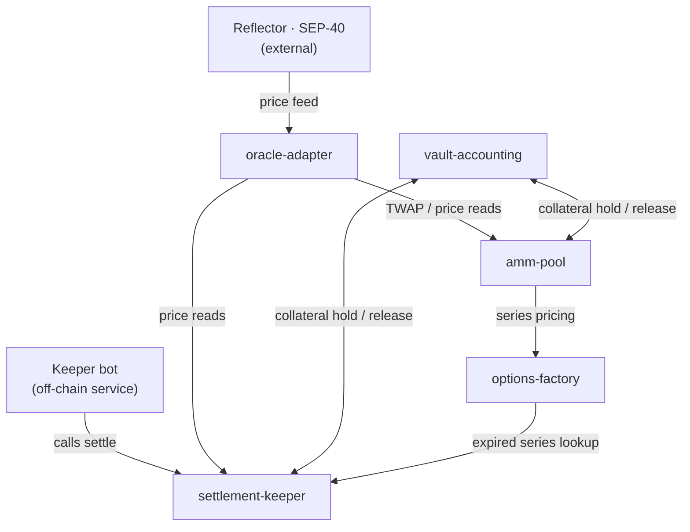

# Umbra — Technical Specification

*companion to the Umbra PRD & Build Plan*

**Umbra — full contract & interface specification**
Storage schemas, function signatures, events, pricing math, and test matrices for all five Soroban contracts — precise enough to implement against without re-deriving decisions mid-build.

| | |
|---|---|
| **Status** | Draft v1.0 |
| **Scope** | Phase 1 — testnet MVP |
| **SDK** | `soroban-sdk`, `sep-40-oracle` 1.4.0 |
| **Style** | European, cash-settled, full collateral |

---

## 01 Scope

This document specifies the five contracts named in the Umbra PRD's architecture section, at the level of detail needed to implement them without inventing behavior mid-build: storage layout, every public function's signature and error cases, every emitted event, and the pricing formula the AMM actually runs. It assumes the Build Plan's sprint order and doesn't repeat environment setup or the sprint schedule — see that document for how this gets built, this document for exactly what gets built.

**Version discipline.** Struct fields for the `sep-40-oracle` crate's `Asset` enum and `PriceData` struct are specified below to match the crate's documented shape as of v1.4.0. Confirm against the installed crate version before implementing `oracle-adapter` — oracle interfaces are the one dependency in this stack Umbra doesn't control.

---

## 02 System architecture

Two contracts have no dependency on the others and sit as shared services on the left and right rails below. The build/call chain runs top to bottom through the center: a priced series is created, then bought against, then eventually settled — the last contract in that chain is the one every other contract's state ultimately flows through.



`oracle-adapter` and `vault-accounting` are shared services with no dependency on each other; `amm-pool` → `options-factory` → `settlement-keeper` is the call chain everything else feeds into.

---

## 03 Global conventions

### Types & math

- All price values are `i128`. No floating point anywhere in contract code — Soroban's deterministic execution model doesn't support it, and it wouldn't round consistently across nodes if it did.
- Every fixed-point value carries an explicit scale documented at its use site (e.g. "7-decimal stroop scale" or "14-decimal Reflector scale") — never assume a global scale constant, since token decimals and oracle decimals differ and must be read from `decimals()` at integration time, not hardcoded.
- Timestamps are `u64` Unix seconds, from `env.ledger().timestamp()`.

### Storage policy

| Kind | Behavior |
|---|---|
| **instance** | Contract-wide config: admin address, linked contract addresses, global parameters. Bundled with the contract instance's own TTL; bump alongside any admin call. |
| **persistent** | Per-key data that must survive indefinitely: LP balances, option series records, open position state. Explicit TTL extension required on write; expired-and-archived entries must be restored before use — write a helper that bumps TTL on every touch rather than relying on callers to remember. |
| **temporary** | Short-lived caches only: e.g. a per-block price snapshot reused within one transaction's cross-calls. Cheapest storage, expires quickly, cannot be restored once gone — never put anything here that a later transaction needs to read. |

### Error pattern

Every contract defines its own `#[contracterror]` enum, `#[repr(u32)]`, numbered in blocks of 100 per contract so error codes never collide if a caller inspects a raw code across contracts:

```rust
#[contracterror]
#[derive(Copy, Clone, Debug, Eq, PartialEq, PartialOrd, Ord)]
#[repr(u32)]
pub enum Error {
    NotAuthorized = 1,
    StalePrice = 2,
    InsufficientCollateral = 3,
    // ...
}
```

**Access control.** Every state-mutating call that acts on behalf of an address requires `address.require_auth()` before any state changes. Admin-only functions (series-grid approval, emergency pause) check the caller against a stored admin `Address` in instance storage, then also call `require_auth()` on it — never trust an unauthenticated equality check alone.

### Events

Every call that changes settleable state publishes an event: `env.events().publish((topic_symbols...), data_tuple)`. Topics are short `Symbol`s (e.g. `("buy", series_id)`); data is the full struct so off-chain indexers and the keeper bot don't need a second read call to act on the event.

---

## 04 Oracle integration (SEP-40)

Reflector implements the SEP-40 standard price feed interface. `oracle-adapter` wraps `sep-40-oracle`'s `PriceFeedClient` rather than any contract calling Reflector directly, so a future oracle swap touches one contract, not five.

| Method | Signature | Returns |
|---|---|---|
| lastprice | `lastprice(asset: &Asset)` | `Option<PriceData>` |
| price | `price(asset: &Asset, timestamp: &u64)` | `Option<PriceData>` |
| prices | `prices(asset: &Asset, records: &u32)` | `Option<Vec<PriceData>>` |
| decimals | `decimals()` | `u32` |
| resolution | `resolution()` | `u32` (seconds per tick) |
| assets | `assets()` | `Vec<Asset>` |

```rust
// expected shape, verify against installed crate
pub enum Asset {
    Stellar(Address),
    Other(Symbol),
}
pub struct PriceData {
    pub price: i128,
    pub timestamp: u64,
}
```

`oracle-adapter` uses `prices(asset, records)` to pull the trailing window needed for realized-volatility calculation in `amm-pool`'s pricing model (Section 07), and `lastprice` for the spot reads used in quoting and settlement.

---

## 05 Contract: `oracle-adapter`

Normalizes the SEP-40 feed into Umbra's internal interface; fails closed on stale or missing prices.

**Depends on:** Reflector (external) · **Depended on by:** `amm-pool`, `settlement-keeper`

### Storage

| Key | Type | Kind | Description |
|---|---|---|---|
| Admin | `Address` | instance | Can update `max_staleness`, the Reflector contract address, and `EwmaLambda`. |
| ReflectorAddr | `Address` | instance | Deployed Reflector price-feed contract on the active network. |
| MaxStaleness | `u64` | instance | Max age in seconds before a price is rejected. Suggested default: 300. |
| EwmaLambda | `u32` | instance | EWMA decay factor, 1e-6 scale (990_000 default == 0.99). Admin-tunable via `set_ewma_lambda`. |
| Ewma(Asset) | `EwmaState` | persistent | Per-asset incremental volatility estimator state — see below. |

### Interface

| Function | Params | Returns | Errors |
|---|---|---|---|
| initialize | `admin: Address, reflector: Address, max_staleness: u64` | `()` | AlreadyInitialized |
| get_price | `asset: Asset` | `(i128, u64)` | StalePrice, PriceUnavailable |
| get_twap | `asset: Asset, window_secs: u64` | `i128` | InsufficientHistory |
| nudge_volatility | `asset: Asset` | `()` | PriceUnavailable |
| get_realized_vol | `asset: Asset` | `u32` (annualized, 1e-6 scale) | InsufficientHistory |
| set_ewma_lambda | `admin: Address, lambda: u32` | `()` | NotAuthorized, InvalidParameter |
| decimals | — | `u32` | — |
| set_max_staleness | `admin: Address, secs: u64` | `()` | NotAuthorized |

`decimals` is a plain pass-through to the underlying Reflector feed's `decimals()`. `amm-pool` and `settlement-keeper` both call it once, at their own `initialize()`, and cache the resulting `10^decimals` as their own `PriceScale` — never a hardcoded constant. This matters in practice: Reflector's testnet CEX/DEX feed (`CCYOZJCOPG34LLQQ7N24YXBM7LL62R7ONMZ3G6WZAAYPB5OYKOMJRN63`) reports 14 decimals, not the 7-decimal stroop scale it's tempting to assume by default.

**A second, sharper version of the same trap:** `PriceScale` (the oracle's decimals) and the collateral token's own decimals are two *independent* numbers — Reflector's feed and a SEP-41 token are different assets with no relationship between their decimal counts. `amm-pool` and `settlement-keeper` both also cache a separate `TokenScale` (read from the collateral token's own `decimals()`) and rescale every notional/premium/payout value from `PriceScale` into `TokenScale` at the last possible moment, immediately before it touches `vault-accounting` or a token transfer. Conflating the two — passing a `PriceScale`-denominated value directly as a token amount — silently computed a notional 10,000,000× too large in an early testnet deployment (Reflector's 14 decimals vs. native XLM's 7): a 1,000-XLM LP pool tried to lock 1.8 million XLM for a single ~$0.18-strike contract. Caught and regression-tested (`buy_with_mismatched_oracle_and_token_decimals_computes_correct_notional` in `amm-pool`'s test suite) before mainnet consideration — worth calling out explicitly since it's the kind of bug that only surfaces once the two scales actually differ, which no amount of testing against same-scale mocks will catch.

**Realized volatility: incremental EWMA, not a fixed-window recompute.** The original design (and an intermediate iteration of this spec) computed realized vol by pulling a trailing window of historical price records and recomputing variance from scratch on every `get_realized_vol` call. Verified live against testnet's Reflector CEX/DEX feed, a `prices()` call requesting more than ~20 records exceeds the transaction's resource budget (confirmed empirically: 20 records succeeds, 24 fails) — nowhere close to the 8,640 records a literal 30-day window would need, and even the 1-hour/12-record window that empirical limit forced is a statistically thin, unstable base for pricing weekly/monthly options: a fixed window's reported vol jumps in discrete steps as extreme samples abruptly enter or exit the window.

`nudge_volatility` replaces this with an incrementally-updated estimator, maintained in `EwmaState` per asset:

```rust
struct EwmaState {
    last_price: i128,
    last_update: u64,
    var_rate: i128,   // per-second variance rate, scaled 1e12
    sample_count: u32,
}
```

Each call pulls at most a single `lastprice()` — never a window — and folds the resulting return into the estimate: `var_rate = lambda * var_rate + (1 - lambda) * (return^2 / dt_seconds)`. Working in a *per-second variance rate* rather than a per-tick or per-window variance is what makes this tolerant of irregular calling intervals: since `Var(return over dt) = sigma^2 * dt` for a Brownian-motion-style price process, each observation's `return^2 / dt` is already a variance-rate sample, comparable and combinable regardless of how much real time elapsed since the last nudge — there is no dependency on the feed's `resolution()` anywhere in the calculation. `get_realized_vol` annualizes with a single multiply (`var_rate * SECONDS_PER_YEAR`) and one `isqrt`.

`nudge_volatility` is permissionless — like `options-factory.create_series`, anyone (in practice, a keeper bot calling it on a regular cadence, or simply piggybacked onto other routine calls) can call it to advance the estimator. It is a safe no-op when the underlying feed hasn't ticked since the last nudge (detected via the price's own timestamp, not the caller's), so nothing is lost by nudging more often than the feed actually updates. Calling it *more* often makes the estimator's real-world memory span *shorter* per unit time, since a fixed per-call decay (`EwmaLambda`) applies each time regardless of elapsed time — `set_ewma_lambda` lets an operator retune the decay factor to match the keeper's actual cadence. The default (`0.99`, ~100 effective observations) assumes roughly one nudge per Reflector tick (~5 min), giving on the order of half a day of effective memory.

`get_realized_vol` requires `MIN_VOL_SAMPLES` (8) prior return observations — i.e. at least 9 `nudge_volatility` calls, since the first only seeds the estimator — before returning a value, for the same reason the old windowed approach required a sample floor: a thin estimate is worse than an explicit error.

`amm-pool`'s test suite includes a direct comparison (`ewma_premiums_are_more_stable_than_windowed_across_a_regime_change`) driving both approaches — the EWMA live through real contract calls, the old windowed formula reimplemented as a pure test-only function for a fair baseline — through an identical simulated calm-then-volatile price sequence, and asserts the EWMA-driven premium's largest single-step jump is smaller than the windowed approach's, both overall and specifically at the regime-change boundary.

### Events

| Event | Topics | Data |
|---|---|---|
| stale_rejected | `("price","stale")` | `(asset, age_secs)` |
| vol_nudged | `("vol","nudged")` | `(asset, var_rate, sample_count)` |

### Invariants

- `get_price` never returns a price older than `MaxStaleness` — it errors instead of returning stale data.
- `get_realized_vol` requires at least `MIN_VOL_SAMPLES` (8) prior `nudge_volatility` return observations, or it errors rather than computing volatility from a thin sample.
- `nudge_volatility` never fabricates a return: if the feed's `lastprice()` hasn't changed timestamp since the last nudge, the call is a no-op rather than recording a synthetic zero-return observation.

---

## 06 Contract: `vault-accounting`

LP deposits, share accounting, and collateral custody backing open option positions.

**Depends on:** USDC token contract (SEP-41) · **Depended on by:** `amm-pool`, `settlement-keeper`

### Storage

| Key | Type | Kind | Description |
|---|---|---|---|
| Admin | `Address` | instance | Set once at init; can register the `amm-pool` and `settlement-keeper` as authorized callers. |
| TokenAddr | `Address` | instance | Collateral asset — USDC via SEP-41 token client. |
| AuthorizedCallers | `Vec<Address>` | instance | Only `amm-pool` and `settlement-keeper` may move locked collateral. |
| Shares(Address) | `i128` | persistent | LP share balance per depositor. |
| TotalShares | `i128` | instance | Sum of all outstanding shares — denominator for share-price calculation. |
| FreeCollateral | `i128` | instance | Idle collateral available for new option writes. |
| LockedCollateral | `i128` | instance | Collateral currently backing open positions — excluded from share-price's "free" figure but still owned by LPs. |
| TokenScale | `i128` | instance | `10^decimals` for the collateral token, read once at `initialize()` — `share_price`'s reporting scale only; every other function moves raw already-token-scale amounts and never touches this. |

### Interface

| Function | Params | Returns | Error |
|---|---|---|---|
| deposit | `from: Address, amount: i128` | `i128` (shares minted) | ZeroAmount |
| withdraw | `from: Address, shares: i128` | `i128` (amount paid) | InsufficientFreeCollateral, InsufficientShares |
| lock_collateral | `caller: Address, amount: i128` | `()` | NotAuthorized, InsufficientFreeCollateral |
| credit_collateral | `caller: Address, from: Address, amount: i128` | `()` | NotAuthorized, ZeroAmount |
| release_collateral | `caller: Address, amount: i128, payout: i128` | `()` | NotAuthorized |
| pay_from_free | `caller: Address, to: Address, amount: i128` | `()` | NotAuthorized, InsufficientFreeCollateral |
| add_authorized_caller | `admin: Address, caller: Address` | `()` | NotAuthorized |
| share_price | — | `i128` | — |

### Events

| Event | Topics | Data |
|---|---|---|
| deposited | `("vault","deposit")` | `(from, amount, shares)` |
| withdrawal | `("vault","withdraw")` | `(from, shares, amount)` |
| withdrawal_queued | `("vault","queued")` | `(from, shares_requested, shortfall)` |

### Invariants

- `FreeCollateral + LockedCollateral` always equals the token contract's actual balance held by this contract — any drift is a critical bug, and the integration test suite asserts this equality after every state-changing call.
- `withdraw` can only pull from `FreeCollateral`; a withdrawal request exceeding it queues rather than partially executing against locked funds.
- `share_price` accounts for unrealized premium owed on open positions, not just idle balance — see Section 13 for why this is the highest-risk calculation in the contract.
- `vault-accounting` never touches the oracle's price scale — deposit/withdraw/lock/credit/release/pay_from_free all move raw, already-token-scale amounts supplied by the caller, with no conversion happening inside this contract at all. The one place a scale choice was ever made here was `share_price`'s *reporting* scale, previously hardcoded to 7 decimals regardless of the actual token — cosmetic (deposit/withdraw never read it, so no fund-safety impact) but silently wrong for any non-7-decimal token, the same hardcoding mistake that broke `amm-pool.buy()` against a 14-decimal oracle. Fixed to read the collateral token's own `decimals()` at `initialize()`, same discipline as everywhere else in this stack, and regression-tested (`share_price_scale_matches_token_decimals_not_a_hardcoded_default`) against a 3-decimal mock token — `register_stellar_asset_contract_v2` can only ever produce Stellar's fixed 7-decimal SAC, so a genuine mismatch needs a purpose-built stub.

---

## 07 Contract: `amm-pool`

Prices premiums and executes buys/sells against `vault-accounting`'s pooled collateral.

**Depends on:** `oracle-adapter`, `vault-accounting` · **Depended on by:** `options-factory`

### Pricing model

European-style, cash-settled premium via the standard Black-Scholes formula, deliberately simplified for v1:

```
C = S·N(d1) − K·N(d2)          (call, r = 0 for v1 — no yield-curve integration yet)
P = K·N(−d2) − S·N(−d1)        (put)

d1 = [ln(S/K) + (σ²/2)·T] / (σ·√T)
d2 = d1 − σ·√T

S  = spot, from oracle-adapter.get_price
σ  = realized volatility, from oracle-adapter.get_realized_vol — an incrementally-updated EWMA estimator, not a fixed-window recompute; see Section 05's implementation note
T  = (expiry − now) / seconds_per_year
K  = strike, fixed at series creation
```

**On-chain N(x) approximation.** Soroban has no floating point. N(x) (the standard normal CDF) is computed via a fixed-point rational approximation (Abramowitz–Stegun 26.2.17 or equivalent), or — given v1's fixed weekly/monthly expiry grid bounds the range of realistic moneyness — a precomputed lookup table indexed by discretized d1/d2 buckets, linearly interpolated. The lookup table is the cheaper option in compute units and is the recommended default; the rational approximation is the fallback if bucket resolution proves too coarse in testing.

*Implementation note:* v1 ships the rational-approximation fallback (Abramowitz–Stegun 26.2.17), not the lookup table — simpler to implement correctly and to unit-test against closed-form sanity checks (`N(0) = 0.5`, symmetry, tail behavior) without needing to pre-generate and validate a bucket table. `ln`, `exp`, and `sqrt` are hand-rolled fixed-point helpers (`contracts/amm-pool/src/math.rs`, 1e9 internal scale) since Soroban's `no_std` environment has none of these available. Revisit the lookup table if the rational approximation's compute-unit cost proves too high in practice.

*MVP simplification — call notional bound:* the pool locks `strike × size` as collateral per contract regardless of side. This is exact for puts (max payout is bounded by strike) but is a cap, not the true unbounded upside, for calls — a spot price more than 2× the strike at settlement pays out capped at the locked notional rather than true intrinsic value. Flagged here in the same spirit as the `r = 0` simplification above; revisit before mainnet if deep ITM calls are expected to be common.

### Storage

| Key | Type | Kind | Description |
|---|---|---|---|
| Admin | `Address` | instance | Can call `set_factory` / `set_settlement`. |
| OracleAddr | `Address` | instance | `oracle-adapter` contract. |
| VaultAddr | `Address` | instance | `vault-accounting` contract. |
| TokenAddr | `Address` | instance | Collateral asset — must match `vault-accounting`'s, needed to forward `sell()` proceeds. |
| FactoryAddr | `Address` | instance | The one caller authorized to call `register_series` — set post-deployment since `options-factory` doesn't exist yet when `amm-pool` is deployed. |
| SettlementAddr | `Address` | instance | The one caller authorized to call `close_position` — set post-deployment for the same reason. |
| FeeBps | `u32` | instance | Protocol fee on premiums, basis points. |
| SeriesMeta(series_id) | struct | persistent | underlying, strike, expiry — pushed here by `options-factory.create_series` via `register_series`, since `amm-pool` has no dependency back on `options-factory`'s own storage. |
| Position(holder, series_id, side) | struct | persistent | size, premium_paid. |
| OpenInterest(series_id) | `i128` | persistent | Total notional open per series_id — read by `vault-accounting`'s risk checks indirectly via lock amounts. |
| HoldersBySeries(series_id) | `Vec<Address>` | persistent | Every distinct address that has bought either side of a series — `settlement-keeper`'s only way to discover who to pay out, since Soroban storage has no native enumeration. |

### Interface

| Function | Params | Returns | Errors |
|---|---|---|---|
| set_factory | `admin: Address, factory: Address` | `()` | NotAuthorized |
| set_settlement | `admin: Address, settlement: Address` | `()` | NotAuthorized |
| is_underlying_supported | `underlying: Asset` | `bool` | — |
| register_series | `caller: Address, series_id: u64, underlying: Asset, strike: i128, expiry: u64` | `()` | NotAuthorized, UnderlyingNotSupported, DuplicateSeries |
| quote | `series_id: u64, side: Side` | `i128` (premium) | SeriesNotFound, SeriesExpired |
| buy | `buyer: Address, series_id: u64, side: Side, size: i128, max_premium: i128` | `i128` (premium paid) | SlippageExceeded, InsufficientFreeCollateral |
| sell | `seller: Address, series_id: u64, side: Side, size: i128, min_premium: i128` | `i128` | SlippageExceeded, NoOpenPosition |
| get_position | `holder: Address, series_id: u64, side: Side` | `Position` | — |
| holders_of_series | `series_id: u64` | `Vec<Address>` | — |
| close_position | `caller: Address, holder: Address, series_id: u64, side: Side` | `Position` (pre-close) | NotAuthorized |

### Events

| Event | Topics | Data |
|---|---|---|
| bought | `("amm","buy",series_id)` | `(buyer, side, size, premium)` |
| sold | `("amm","sell",series_id)` | `(seller, side, size, premium)` |

### Invariants

- `buy` calls `vault-accounting.lock_collateral` for the full notional before releasing the position — no undercollateralized state is ever reachable in v1.
- The quote and the buy that follows it can diverge if the oracle price moves between calls; `max_premium`/`min_premium` slippage bounds are mandatory parameters, not optional.

---

## 08 Contract: `options-factory`

Creates and registers option series on a fixed strike/expiry grid; the catalog `amm-pool` prices against.

**Depends on:** `amm-pool` (validates underlying is supported) · **Depended on by:** `settlement-keeper`, demo frontend

### Storage

| Key | Type | Kind | Description |
|---|---|---|---|
| Admin | `Address` | instance | Approves new underlyings and expiry-grid changes. |
| NextSeriesId | `u64` | instance | Monotonic counter. |
| Series(series_id) | `SeriesInfo` | persistent | underlying, strike, expiry, created_at. |
| SeriesByUnderlying(Asset) | `Vec<u64>` | persistent | Index for `list_series`. |
| ApprovedExpiries | `Vec<u64>` | instance | Allowed expiry timestamps — the fixed weekly/monthly grid from the PRD's MVP scope. |

### Interface

| Function | Params | Returns | Errors |
|---|---|---|---|
| create_series | `underlying: Asset, strike: i128, expiry: u64` | `u64` (series_id) | ExpiryNotApproved, UnderlyingNotSupported, DuplicateSeries |
| list_series | `underlying: Asset` | `Vec<SeriesInfo>` | — |
| get_series | `series_id: u64` | `SeriesInfo` | SeriesNotFound |
| approve_expiry | `admin: Address, expiry: u64` | `()` | NotAuthorized |

### Events

| Event | Topics | Data |
|---|---|---|
| series_created | `("factory","created")` | `(series_id, underlying, strike, expiry)` |

### Invariants

- `create_series` succeeds for any caller as long as the expiry is on the approved grid, regardless of who calls — creation is permissionless once the grid slot exists, only the grid itself is admin-gated. This keeps market creation open without letting anyone invent off-grid expiries the risk model wasn't sized for.

---

## 09 Contract: `settlement-keeper`

Handles exercise/expiry settlement — the contract the off-chain keeper bot calls, and where every other contract's state resolves.

**Depends on:** `oracle-adapter`, `vault-accounting`, `options-factory`, `amm-pool` · **Depended on by:** keeper bot (off-chain)

### Storage

| Key | Type | Kind | Description |
|---|---|---|---|
| OracleAddr, VaultAddr, FactoryAddr, AmmPoolAddr, TokenAddr | `Address` | instance | The four dependency addresses plus the collateral token, all set at init. |
| PriceScale | `i128` | instance | `10^decimals` for the oracle's price feed — must match `amm-pool`'s own `PriceScale`, since both price the same strike/spot values. Read once at `initialize()` via `oracle-adapter.decimals()`. |
| TokenScale | `i128` | instance | `10^decimals` for the collateral token — must match `amm-pool`'s own `TokenScale`. Notional/payout values computed in `PriceScale` are rescaled into this immediately before any fund movement — see the invariant below. |
| Settled(series_id) | `bool` | persistent | Prevents double-settlement of a series_id. |
| KeeperRewardBps | `u32` | instance | Share of settled ITM payout paid to whoever calls `settle`. |

### Interface

| Function | Params | Returns | Errors |
|---|---|---|---|
| settle | `caller: Address, series_id: u64` | `()` | NotYetExpired, AlreadySettled, SeriesNotFound |
| is_settleable | `series_id: u64` | `bool` | — |

### Events

| Event | Topics | Data |
|---|---|---|
| settled | `("keeper","settled",series_id)` | `(final_price, total_payout, keeper_reward, caller)` |

### Invariants

- `settle` is idempotent-safe: a second call on an already-settled series errors rather than double-paying, even if two keeper bots race each other.
- Settlement price is read via `oracle-adapter.get_price` at call time, not cached from series creation — this is the one place a stale-price rejection genuinely blocks user funds from resolving, so `MaxStaleness` in `oracle-adapter` needs to be tuned loosely enough that a temporary feed gap doesn't strand settlement indefinitely.
- `settle`'s payout math does the same kind of price-to-collateral conversion as `amm-pool.buy()`'s notional calculation — `strike`/`intrinsic` values live in `PriceScale`, but the amounts released through `vault-accounting` and transferred to holders must be in `TokenScale`. Both `notional` and `raw_payout` (and therefore the capped `payout`) are rescaled from `PriceScale` to `TokenScale` before touching `vault.release_collateral` or the token transfer — regression-tested (`settle_pays_correct_amount_with_mismatched_oracle_and_token_decimals`) against the same 14-decimal-oracle/7-decimal-token mismatch that broke `buy()`, asserting the exact expected payout rather than a loose bound. `keeper_reward` itself never needs rescaling: it's a bps cut of `total_payout`, which is already `TokenScale` by the time it's summed.

---

## 10 Call sequences

### Create series → quote → buy

1. Admin (or any caller, per the permissionless-creation invariant) calls `options-factory.create_series(underlying, strike, expiry)` → returns `series_id`, emits `series_created`.
2. Buyer calls `amm-pool.quote(series_id, side)` → internally calls `oracle-adapter.get_price` and `get_realized_vol`, runs the Black-Scholes calculation, returns a premium.
3. Buyer calls `amm-pool.buy(buyer, series_id, side, size, max_premium)`.
4. `amm-pool` calls `vault-accounting.lock_collateral(caller=amm-pool, amount=notional)` — errors here abort the whole transaction, so no partial state is possible.
5. `amm-pool` transfers premium from buyer to `vault-accounting`'s free collateral, records the `Position`, emits `bought`.

### Volatility nudging (ongoing, independent of the above)

1. On a regular cadence (roughly matching the oracle feed's own tick rate — e.g. once per Reflector resolution, ~5 min), a keeper bot (or any permissionless caller) calls `oracle-adapter.nudge_volatility(asset)` for each asset with an active series.
2. Each call pulls at most one `lastprice()` and folds the observed return into that asset's EWMA estimator — cheap enough to run indefinitely, unlike a window-based recompute. A call is a safe no-op if the feed hasn't ticked since the last nudge.
3. `amm-pool.quote`/`buy`/`sell` read whatever `get_realized_vol` currently reports — they never nudge the estimator themselves, so pricing quality depends on this cadence actually running. A series with no recent nudges simply serves a stale-but-not-erroring vol estimate (unlike `get_price`, `get_realized_vol` has no staleness check of its own — the EWMA's decay is the only mechanism keeping it responsive).

### Settlement

1. Keeper bot polls `settlement-keeper.is_settleable(series_id)` for each series past its expiry timestamp.
2. Keeper bot calls `settlement-keeper.settle(caller=keeper_address, series_id)`.
3. `settlement-keeper` calls `oracle-adapter.get_price` for the final settlement price.
4. For each open position (from `amm-pool`'s position records), calls `vault-accounting.release_collateral` to pay ITM holders and return unused collateral to the LP pool.
5. Pays the keeper reward from the settled premium pool, marks `Settled(series_id) = true`, emits `settled`.

---

## 11 Test matrix

Minimum case coverage per contract before a sprint is considered done — not exhaustive, but the floor.

| Contract | Case | Asserts |
|---|---|---|
| oracle-adapter | Price older than MaxStaleness | StalePrice error, no fallback value returned. |
| oracle-adapter | Realized vol with < minimum samples | InsufficientHistory error. |
| oracle-adapter | nudge_volatility called twice with no new feed tick | Second call is a no-op — no fabricated zero-return observation, sample count unchanged. |
| oracle-adapter | nudge_volatility's first-ever call for an asset | Seeds last_price/last_update only; still InsufficientHistory until a return exists. |
| oracle-adapter | set_ewma_lambda out of bounds (0 or ≥ 1e6) | InvalidParameter error. |
| amm-pool | EWMA vs. windowed premium stability across a simulated calm→volatile regime change | EWMA-driven premium's largest single-step jump is smaller than the windowed formula's, both overall and at the regime-change boundary. |
| vault-accounting | Deposit, withdraw same block | Share price unchanged; no phantom yield from round-tripping. |
| vault-accounting | Withdraw exceeding free collateral | Queues rather than partially executing against locked funds. |
| vault-accounting | Dust-amount deposit (1 stroop) | No rounding-to-zero share mint; either mints correctly or rejects explicitly. |
| vault-accounting | share_price against a non-7-decimal collateral token | Reports "1.0" at the token's own scale, not a hardcoded 7-decimal default. |
| amm-pool | Quote with volatility ≈ 0 | Premium approaches intrinsic value, no division-by-zero in d1/d2. |
| amm-pool | Buy with stale oracle price | Reverts via oracle-adapter's error, no trade executes at a stale price. |
| amm-pool | Buy at max i128 notional | No silent overflow — checked arithmetic throughout premium and lock calculations. |
| amm-pool | Buy with mismatched oracle/token decimals (14 vs. 7) | Notional and premium land at the correct, exact token-scale value — not the oracle-scale value passed through unrescaled. |
| options-factory | Create series on non-approved expiry | ExpiryNotApproved error. |
| settlement-keeper | Double settle same series | Second call errors, first call's payout is untouched. |
| settlement-keeper | Settle before expiry | NotYetExpired error. |
| settlement-keeper | Settle with mismatched oracle/token decimals (14 vs. 7) | ITM payout lands at the correct, exact token-scale value — not the oracle-scale value passed through unrescaled. |
| integration | Full create → quote → buy → advance-time → settle | Buyer balance, LP share price, and keeper reward all match hand-calculated expected values. |

---

## 12 Initialization order

Constructors need each other's addresses, so deployment is strictly ordered — deploying out of order means redeploying, since Soroban contract addresses aren't known until after deployment.

1. Deploy `oracle-adapter`. Initialize with admin address and the network's Reflector contract address.
2. Deploy `vault-accounting`. Initialize with admin address and the USDC token contract address.
3. Deploy `amm-pool`. Initialize with `oracle-adapter`'s and `vault-accounting`'s addresses.
4. Call `vault-accounting`'s `AuthorizedCallers` admin function to register `amm-pool`'s address (it needs to call `lock_collateral`).
5. Deploy `options-factory`. Initialize with `amm-pool`'s address and the initial approved-expiry grid.
6. Deploy `settlement-keeper`. Initialize with all four preceding addresses.
7. Register `settlement-keeper` as an additional authorized caller on `vault-accounting` (it needs `release_collateral`).

---

## 13 Security invariants

- Nothing other than `vault-accounting` ever holds collateral directly — `amm-pool` and `settlement-keeper` only ever call `lock_collateral`/`release_collateral`, keeping custody in exactly one audited place.
- Every arithmetic operation on collateral or premium amounts uses checked (not wrapping) `i128` operations — an overflow must revert the transaction, never wrap silently.
- Share price in `vault-accounting` is the single most consequential calculation in the system: it must reflect locked collateral's mark-to-market exposure, not just free balance, or LPs can be diluted or over-credited around large open positions. This gets its own dedicated test file, not just inline coverage in the general suite.
- Assume `oracle-adapter` fails closed. Nothing downstream should ever treat a missing price as zero, none, or "use the last known value" without that being an explicit, separately-reviewed decision.
- Admin keys (one per contract at MVP) are a known centralization point for a testnet-stage protocol — the PRD's Phase 2 audit should scope whether these move to a multisig or timelock before mainnet, not leave it implicit.
- **Scale conflation (oracle `PriceScale` vs. collateral `TokenScale`) is a bug class, not a one-off — audited across the whole stack after the first instance broke `amm-pool.buy()` on testnet.** Every place a value crosses from the oracle's price scale into an actual token amount:
  - `amm-pool.quote`/`buy`/`sell` — premium and notional, rescaled before touching `vault-accounting` or a token transfer. Regression-tested with mismatched (14 vs. 7) decimals.
  - `settlement-keeper.settle` — notional and payout, same rescale, same reasoning, since it computes the mirror-image (paying collateral back out) of what `buy()` computes going in. Regression-tested the same way.
  - `oracle-adapter` — audited and confirmed clean: it never touches `TokenScale` at all. Every value it returns (`get_price`, `get_twap`, `get_realized_vol`) stays in the oracle's own price scale or the dimensionless annualized-vol ratio; it has no concept of a collateral token and shouldn't.
  - `options-factory` — audited and confirmed clean: `strike` passes through as an opaque `i128`, stored and forwarded via `register_series` but never combined with a token amount or rescaled anywhere in this contract.
  - `vault-accounting` — audited and confirmed clean for fund movement: every function that actually moves collateral (`deposit`, `withdraw`, `lock_collateral`, `credit_collateral`, `release_collateral`, `pay_from_free`) works purely in raw, caller-supplied token-scale amounts, with no scale conversion inside this contract at all. The one place a scale value ever mattered here was `share_price`'s *reporting* scale, previously hardcoded to 7 decimals — cosmetic, not a fund-safety bug (nothing fund-moving reads it), but the same category of mistake. Fixed and regression-tested against a 3-decimal mock token.

  Rule going forward: any new function that combines a value read from `oracle-adapter` with a value that will be locked, transferred, or compared against a token amount must rescale from `PriceScale` to `TokenScale` explicitly, at the point of crossing, and that crossing needs a test using genuinely different oracle/token decimal counts — a same-scale mock (the default in most of this suite's test setups) cannot catch this class of bug by construction.

---

## 14 Sources

- `sep-40-oracle` — `PriceFeedClient` (docs.rs)
- Stellar Docs — Oracle Providers
- Stellar Docs — Smart Contracts Overview & Rust SDK
- `soroban-sdk` (docs.rs)
- `reflector-network/reflector-contract` (GitHub)
